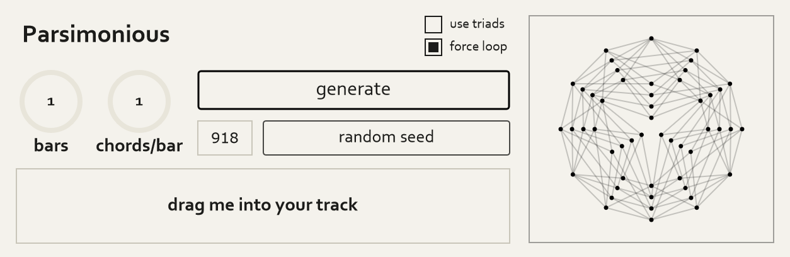
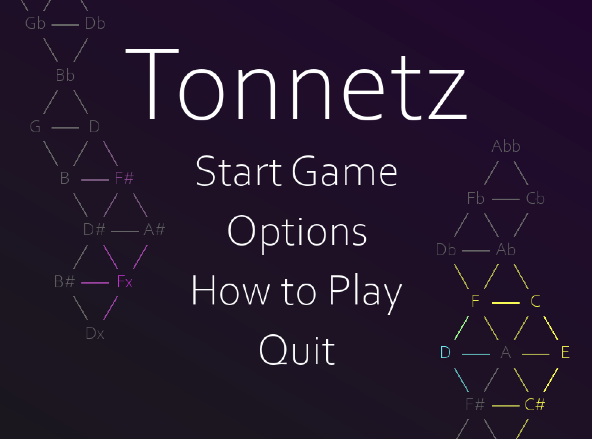

# Welcome

### About
My name is Ayaz and I'm a first year masters student studying music tech at NYU. I play Euphonium, compose, and create tools for other musicians. My technical interests include software/plugin development, machine learning, and signal processing. I'm classically trained, but my musical interests include Lo-fi, EDM, Jazz, and film/video game music. Feel free to reach out if you want to connect. :)

Email: [ayazearley@gmail.com](mailto:ayazearley@gmail.com)  
Youtube: [youtube.com/@AyazEarley](https://www.youtube.com/@AyazEarley)

### Skills
- **Languages:** C++, Python, Java, JavaScript, TypeScript
- **Frameworks/Libraries:** JUCE, PyTorch, React, Manim, NumPy, Librosa, PyGame
- **Audio/Notation:** MuseScore 4, FL Studio, Audacity
- **Tools:** Git, CMake, Visual Studio

# Projects at a Glance:

### Parsimonious
A new way to generate chord progressions using graph theory

### Tonnetz 
A strategy game where players battle for control over the soundtrack

### Single Label Instrument Classifier:
Using transfer learning and DSP to classify 11 instruments with 83% accuracy.

| Instrument       | Validation Accuracy |
|------------------|---------------------|
| Cello            | 87.18%              |
| Clarinet         | 80.20%              |
| Flute            | 75.56%              |
| Acoustic Guitar  | 93.70%              |
| Electric Guitar  | 77.63%              |
| Organ            | 91.18%              |
| Piano            | 84.03%              |
| Saxophone        | 72.80%              |
| Trumpet          | 89.66%              |
| Violin           | 71.55%              |
| Voice            | 90.38%              |
| **Overall**      | **83.08%**          |

